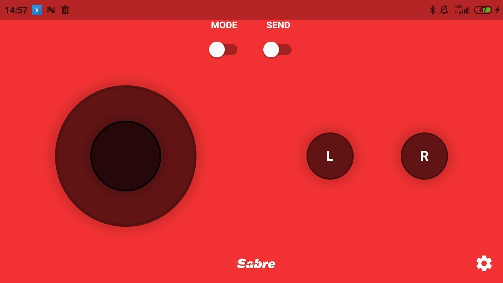

# flutter joystick

Flutter Joystick project. You can use this application to control devices by http connection.
There are two modes. Manual - when we have control via knob, Accelerometer - when we have control by moving device.

## Getting Started

For help getting started with Flutter, view our
[online documentation](https://flutter.dev/docs), which offers tutorials,
samples, guidance on mobile development, and a full API reference.

Other helpful links
- [Lab: Write your first Flutter app](https://flutter.dev/docs/get-started/codelab)
- [Cookbook: Useful Flutter samples](https://flutter.dev/docs/cookbook)
